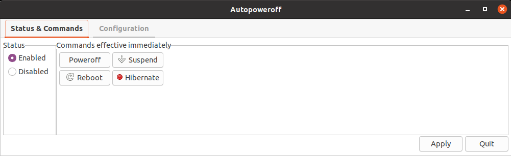
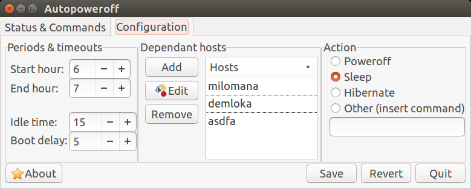

Autopoweroff
======================================================================


Status as of 2019 - Fully supported.
======================================================================

This program is actively supported, but is simply not being developed much
anymore because it is now mature and nobody reports any problem with it.
There is no more need for new features either.  So do not judge the software
by the number of commits.

It is compatible with many current Linux distributions.  Try it and if you
have any issue, please report it; we will work hard to get things fixed.


About Autopoweroff
======================================================================

Autopoweroff is a daemon that is started at boot time, and which function is
to run a command at a specific time, but only if some conditions are met.
Originally, this application would only shutdown the computer, thus its name,
but now it can suspend, hibernate, or run any custom command provided by the
user.

This software is meant for the Linux operating system only.  It should work on any modern Linux distribution.  Deb and RPM packages are available.

The computer will execute the command (suspend by default) if all the above
conditions are met:

* Any hosts that the computer is dependent on is not answering ping anymore.
* No keyboard or mouse activity has been detected on the computer for a while.
* The user has not disabled Autopoweroff.

One good use of Autopoweroff is for home use, on a firewall/router server.
You can setup Autopoweroff to suspend/shutdown the server every evening at
say, 22:00.  However, your server might serve other computers in your home.
Autopoweroff will shutdown the server after 22:00 only if no other computer
on the network is responding to <code>ping</code>.  For example, if at 22:43
you are still working on your thin client in the living room, the server in
your baseman will remain up.  As soon as you shutdown the workstation, the
server will go down.

The server can boot automatically every morning by setting its BIOS
properly.  Autopoweroff has nothing to do with this process.  But with
this setting, your home server does not need to run 24/7.  The advantages
such a setting offers are:

* Increase security.  Nobody can hack your server while its suspended, in
  hibernation or shutdown.
* Save electricity and curb down heat generation.
* Cut down noise.  A shutdown server does not produce any noise.
* Avoid the hassle of having to shut down and start up the server manually.

A nice GUI is provided to configure Autopoweroff's parameters.  See
  <section-link href="#config_autopoweroff_gui">Autopoweroff configurator</section-link>.

Note that one day, it might be possible to replace this piece of software with SystemD.  Currently I have no OS with SystemD installed to test.


Supported Linux distributions
======================================================================

Autopoweroff will work on most distributions. However, for some
distribution you might have to manually move files to the right place to
get it working and write your own init script so that Autopoweroff would
start at booting. If you install Autopoweroff from the tarball, this is
more likely.

Fully supported distributions include: **Ubuntu**, **Debian**, **Fedora/Red
Hat** and **openSuSE/SLED/SLES**. It should also work with any derivative of
these distributions. Download the .rpm or .deb package and everything will be
installed and enabled automatically. This include setting up Autopoweroff to
start at the next computer boot. And if you decide to remove Autopoweroff,
everything gets removed.

With a package, you will only have to run the GUI configuration tool or
edit `/etc/autopoweroff.conf` to your particular needs. Autopoweroff
will be eventually submitted to Ubuntu's and Fedora's repositories,
making it even easier to install.

Help wanted
--------------------------------------------------

If you are running a distribution that is not yet supported by Autopoweroff,
write to me. I will ask you some questions about your distribution and
probably be able to add support for it.


Download / Releases
======================================================================

The latest version of Autopoweroff can be downloaded from
[GitHub](https://github.com/deragon/autopoweroff/releases)


Following the project status
======================================================================

You may follow the project's status also from the following sites:

* [OpenHub](https://www.openhub.net/p/autopoweroff)


Autopoweroff configuration
======================================================================

There are two ways to configure Autopoweroff.

* Use the [GUI configuration tool](#config_autopoweroff_gui).
* Edit manually the configuration file
    [`autopoweroff.conf`](#config_autopoweroff_file).

Autopoweroff GUI configuration tool
--------------------------------------------------

The Autopoweroff GUI configuration tool is mostly self explanatory.  To start the GUI configuration tool simply search for "autopoweroff" on your desktop.  If all else fail, you can call `/usr/bin/autopoweroff` from a file manager or a terminal.

In the first panel named *Status & Commands*, the user can enable or
disable Autopoweroff and poweroff or reboot the computer.



*Status & commands*

In the second panel named *Status & Commands*, the user can configure
the different parameters of Autopoweroff. See [Autopoweroff
configuration file](#config_autopoweroff_file) for a description of the
different parameters.



*Configuration*

Autopoweroff configuration file (autopoweroff.conf)
--------------------------------------------------

The `/etc/autopoweroff.conf` (or `${prefix}/etc/autopoweroff.conf`, for
those who installed from the tarball) configuration file is well
documented and easy to understand. Following is an example:

```
# Autopoweroff Test version configuration file.

# WARNING:  If you decide to edit this file, edit only the values of the
#           parameters.  If you add comments, they will be lost at the
#           next software upgrade or when the GUI configurator is being
#           used to update the file.  Only values persists.


# StartHour and EndHour parameters (expressed in hours):
#
#   Following is the time range where the computer should not shutdown
#   even if all conditions are met.  In this example where StartHour=5
#   and EndHour=22, the computer will not shut down between 05:00 and
#   22:00, local time.

[NO_SHUTDOWN_TIME_RANGE]
StartHour=6
EndHour=7


# StartupDelay parameter (expressed in minutes):
#
#   When the computer is booting up, if all the conditions are met and
#   the computer is in the shutdown time range, as soon as Autopoweroff
#   is started, the computer will shutdown.  Thus, the user will never
#   have the chance to boot into the computer.  This is where the
#   "delay" parameter comes in.  If "delay" is set to 15 for example,
#   Autopoweroff will not poweroff the computer even if all the
#   conditions are met, for a period of 15 minutes after the computer
#   has booted.  This allows the user to login and change Autopoweroff's
#   configuration.
#
#
# IdleTime parameter (expressed in minutes):
#
#   Like a screensaver, Autopoweroff detects keyboard and mouse
#   activity, and if there is any activity on the server, it would not
#   be powered off regardless if all the other conditions are met.  If
#   set to 0, user activity on the server will be ignored.

[TIMEOUTS]
StartupDelay=5
IdleTime=15


# Hosts parameter (list of hostnames or IPs, separated by commas):
#
#   Here you list the list of hosts your machine is dependant, i.e. this
#   computer should not shutdown if any of the hosts declared here is
#   still up (responding to ping).

[DEPENDANTS]
Hosts=server1, server2, server3


#  [ACTION]
#
#  Action
#
#   Action to be taken when all conditions are met.
#
#   Choices are:
#
#     - Shutdown
#     - Sleep     (suspend to ram)
#     - Hibernate (suspend to disk)
#     - Other     (ActionCommand must be supplied)
#
# ActionCommand
#
#   In some cases, users want to specifiy the action command.  It could be a
#   script, a special version of /usr/sbin/shutdown, etc...  Arguments are
#   added after the command.  Example:
#
#   ActionCommand=/usr/sbin/shutdown -r now
#
#   Strictly speaking, the command could be anything, including actions
#   that has nothing to do with powering down a computer.  In that sense,
#   'Autopoweroff' is a misnomer; it should have been called something like
#   'ScheduledAction'.
#
#   Autopoweroff already have standard Linux command hardcoded for shutting
#   down, sleep or hibernate the computer.  Therefore, this command comes
#   commented in the default configuration file.
#
#   Since this option is an advance one, it is not available from the GUI.
[ACTION]
Action=sleep
ActionCommand=None

```

UEFI / BIOS configuration
======================================================================

It is possible to setup the UEFI / BIOS so that the computer will boot itself
every day. Each UEFI / BIOS is different, but they are pretty much similar.
Following are the instructions on how to setup on various systems.

Award BIOS
--------------------------------------------------

On the main page, select the menu *POWER*, then the *POWER UP CONTROL*
item. Once the new screen shows up, move the cursor to the *Automatic
Power Up* line and select *Everyday*. On the following line, set the
time at which the computer should start everyday. Save the settings and
voilà.


Installation
======================================================================

To install the .deb package, simply run:

    sudo dpkg -i autopoweroff*.deb     `

To install the .rpm package, simply run:

    rpm -Uhv autopoweroff*.rpm   `

For the tarball, extract it and run `configure` followed by `make install`.

    tar xvzf autopoweroff.tar.gz
    cd autopoweroff
    configure --prefix="<path to the installation directory>"
    make install    `

You will need to setup the init script properly. Two versions exists.


Uninstallation
======================================================================

To uninstall the .deb package, simply run:

    sudo dpkg -r autopoweroff

To uninstall the .rpm package, simply run:

    rpm -e autopoweroff

If you installed from the tarball, run

    autopoweroff_uninstall


License
======================================================================

This software is covered by the [GPL
2.0](http://www.gnu.org/licenses/gpl.html#TOC1) license. For a local
copy of the license, see file COPYING.


Troubleshooting
======================================================================

Troubleshooting Glade warnings
--------------------------------------------------

Do not be alarmed by glade warning message showing up when you are
running the `autopoweroff` command (the GUI configurator). These warning
appears because you are running a different version of Gnome than the
one upon which Autopoweroff was built. Probably you are running an older
version, thus some new properties that were introduced are not supported
on your older system.

Troubleshooting /etc/init.d/autopoweroff upgrade
--------------------------------------------------

Under Debian Policy, /etc/init.d files are considered configuration file
like any other /etc file. Thus when Autopoweroff upgrades its
/etc/init.d file, apt (or your software package manager) will prompt you
asking if you want to keep the original file or not.

This make sense because some people actually modify /etc/init.d files to
suit their particular needs. Ideally though, the software package
manager should not prompt if the original file has not change when
upgrading. Alas, this is not the case except only for the most recent
version of Linux (this comment was written in September 2008).

See: [Ubuntu Bug
\#246550](https://bugs.launchpad.net/ubuntu/+source/sysvinit/+bug/246550)


For Developers
======================================================================

Autopoweroff might be of interest to developers because of the
following reasons:

* This project is a very nice example on how to write a Python daemon that probes input devices, make use of threads
* It is also a very good example about packaging for .deb and .rpm based distributions, and universal tarball. It makes heavy use of autoconf and automake.
* Finally, be this project a lesson; if you distribute your software as a
  tarball, provide an easy solution to de-install it. Either provide a script
  like Autopoweroff is doing, or provide a "make uninstall" target.


To do
======================================================================

The following are features to be added in future releases.

* Detect activity from a remote login, either it be console or an X session.
  Currently, if someone is working remotly on the computer, this will go
  undetected and Autopoweroff will proceed with the shutdown if all other
  conditions are met.
* Internationalization (i18n). Autopoweroff is currently available only in
  English.
* New GUI that follows more closely the Gnome recommendations.
* Better documentation, including writing a man page.
* Support for a wider range of Linux distributions.


Miscelleanous
======================================================================

* This document source is a Markdown document.  The following tools are used
  for editing it.

  * [Vim text editor](http://www.vim.org/)
  * [MdCharm](http://www.mdcharm.com/)


Change log
======================================================================

  Change log is saved in file [CHANGELOG.md](CHANGELOG.md).


Contact
======================================================================

If you have any questions or issues with this software, you can contact
the following persons:

Author:    Hans Deragon
Email:     <hans@deragon.biz>
Website:   [www.deragon.biz](http://www.deragon.biz)
